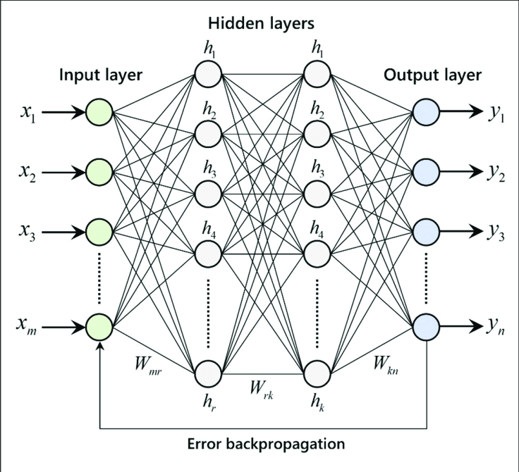

<!DOCTYPE html>
<html lang="en">
<head>
    <meta charset="UTF-8">
    <meta name="viewport" content="width=device-width, initial-scale=1.0">
    <title>Neural Network Description</title>
</head>
<body>
    <h1>Neural Network Description</h1>
    

        I have implemented a neural network from scratch using Python and Jupyter Notebook. The neural network consists of multiple layers including input, hidden, and output layers. Each neuron in the network applies weights to the input data, followed by an activation function to produce the output.
    

    

        The model architecture includes fully connected layers with ReLU activation functions for hidden layers and softmax activation function for the output layer in the case of classification tasks. I have used stochastic gradient descent (SGD) as the optimization algorithm and categorical cross-entropy as the loss function during training.
    

    

        For training the neural network, I used a labeled dataset consisting of feature vectors and corresponding target labels. The dataset was split into training and validation sets to monitor the model's performance and prevent overfitting. The training process involved iterating over the dataset for multiple epochs, adjusting the model's weights using backpropagation, and evaluating the model's performance on the validation set.
    

    

        After training the neural network, I evaluated its performance on a separate test dataset to assess its generalization ability. The evaluation metrics included accuracy, precision, recall, and F1-score depending on the specific task. 
    

    
    
</body>
</html>
<!DOCTYPE html>
<html lang="en">
<head>
    <meta charset="UTF-8">
    <meta name="viewport" content="width=device-width, initial-scale=1.0">
    <title> </title>
</head>
<body>
    <h1>Forward Pass in Neural Network</h1>
    

        The forward pass is a fundamental step in the operation of a neural network. It is the process by which input data is fed through the network's layers to generate an output prediction.
    

    

        During the forward pass, each layer of the neural network performs two main operations: 
        <ul>
            <li>1. **Linear Transformation**: The input data is multiplied by a weight matrix and added to a bias vector. This step computes the weighted sum of inputs to each neuron in the layer.</li>
            <li>2. **Activation Function**: The result of the linear transformation is passed through an activation function. This introduces non-linearity into the network, allowing it to learn complex patterns in the data.</li>
        </ul>
    

    

        The output of one layer serves as the input to the next layer, and this process continues until the data passes through all the layers of the network. The final output generated by the output layer represents the prediction made by the neural network for the given input.
    

    
</body>
</html>
<!DOCTYPE html>
<html lang="en">
<head>
    <meta charset="UTF-8">
    <meta name="viewport" content="width=device-width, initial-scale=1.0">
    <title></title>
</head>
<body>
    <h1>Loss Function in Neural Networks</h1>
    
In neural networks, the loss function measures the disparity between predicted and actual values during training. The mean squared error (MSE) is a common loss function, expressed as:

    
ğ¹(𝑥) = ğ¸[(𑡠− 𝑎(𝑥))2]

    
Here, 𝑡 represents the actual target value, and 𝑎(𝑥) is the predicted output for input 𝑥. The goal is to minimize this function, achieved through techniques like backpropagation and gradient descent, to enhance predictive accuracy.

</body>
</html>
<!DOCTYPE html>
<html lang="en">
<head>
    <meta charset="UTF-8">
    <meta name="viewport" content="width=device-width, initial-scale=1.0">
    <title>Stochastic Gradient Descent</title>
</head>
<body>
    <h1>Stochastic Gradient Descent</h1>
    

        Stochastic Gradient Descent (SGD) is a widely used optimization algorithm in deep learning and machine learning. It is employed to optimize model parameters and is often more computationally efficient when dealing with large datasets.
    

    

        SGD approximates the gradient using each training example (input, target output) and updates the model parameters. This means that the gradient is computed from a random subset of the data rather than the entire dataset, resulting in a faster training process.
    

    

        One of the main advantages of SGD is its ability to reduce the risk of getting stuck in local minima. Random sampling allows for a more diverse and unpredictable update of the gradient, which often helps reach the global minimum faster.
    

    
</body>
</html>
<!DOCTYPE html>
<html lang="en">
<head>
    <meta charset="UTF-8">
    <meta name="viewport" content="width=device-width, initial-scale=1.0">
    <title></title>
</head>
<body>
    <h1>Backpropagation</h1>
    

        Backpropagation is a key algorithm for training artificial neural networks. It allows the network to update its parameters in order to minimize the error between the predicted output and the actual output.
    

    

        The process of backpropagation involves computing the gradient of the loss function with respect to each parameter in the network. This gradient is then used to update the parameters using an optimization algorithm such as stochastic gradient descent.
    

    

        Backpropagation works by propagating the error backwards through the network, hence the name. It calculates the contribution of each parameter to the overall error, allowing the network to adjust its weights and biases accordingly.
    

</body>
</html>

